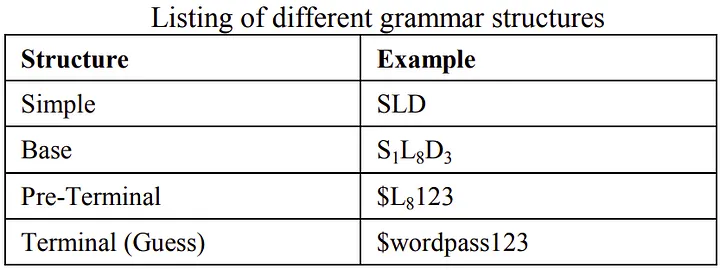
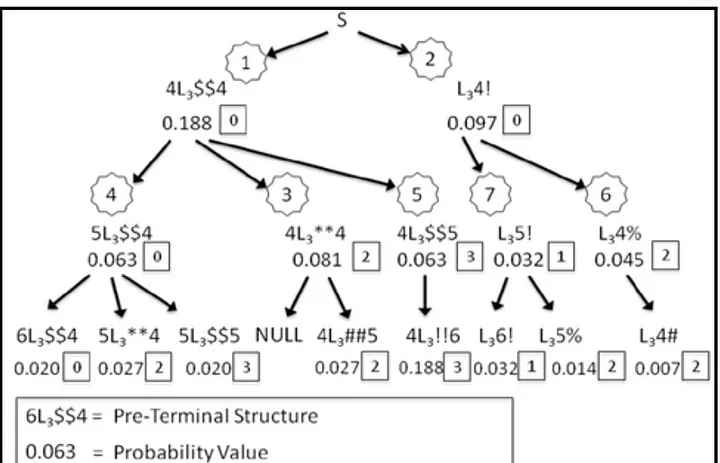
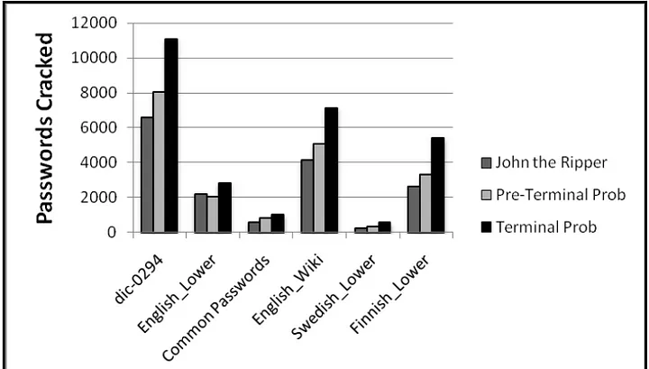
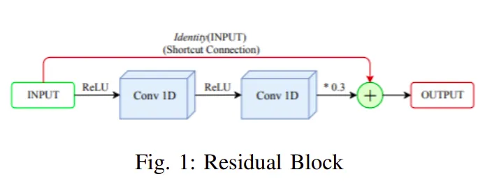
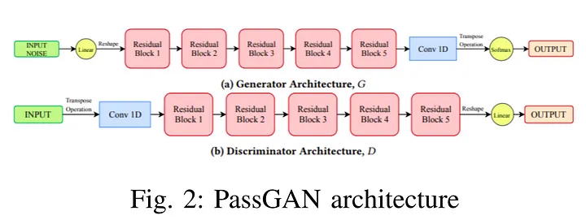
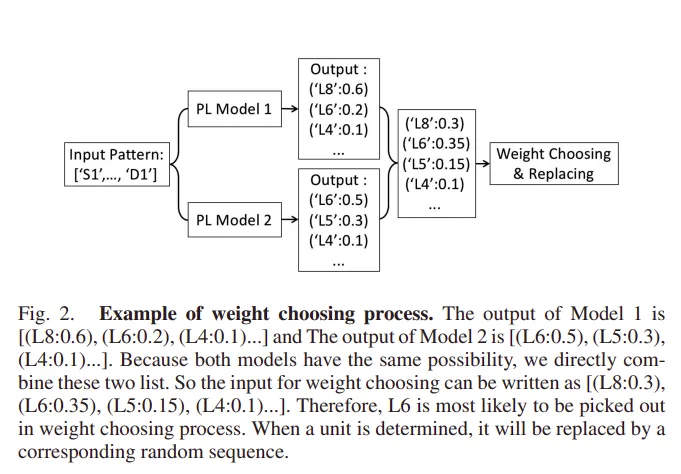
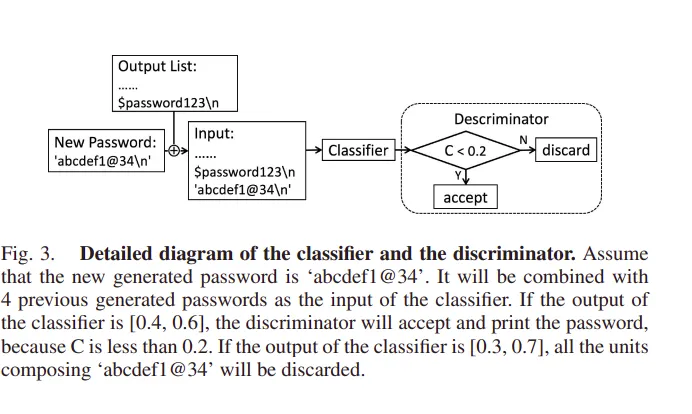

On hearing the term "password-cracking," many will think this post will be about how to guess someone's password or somewhat similar, but the reality is not always so satisfying.

**What is Password Cracking**
=============================

In general, whenever anybody types a password on any device or software, passwords don't get stored in the raw format in the database. Instead, raw passwords are first passed through the hashing algorithm, which converts the raw passwords into some particular sequence of letters, numbers, and special characters which looks entirely random for an ordinary being.

Now there are several password database leaks and breaches all over the world. One such dataset is Rockyou Dataset, which contains **about 31 million passwords;** this is a widely used dataset because this dataset contains passwords in plain text format without any hashing. Most password cracking algorithms are either trained using this dataset or have used this for dictionary attacks.

These algorithms decrypt the hashes of the passwords obtained from other password databases leaks. These algorithms generate passwords, hashes them using the encryption algorithm, and then compare the hash with the hashes present in the database; if the hash matches, Bingo! We got the password corresponding to that hash; otherwise, keep generating and comparing passwords. Password hashes generated by the encryption algorithm are such that they can't be reverted. Passwords, once hashed, can not be converted back into passwords by any algorithm other than brute force attacks over the hash of every possible password.

Hashcat
=======

Hashcat is one of the most popular and widely used password crackers. It uses various kinds of attacks for cracking the passwords like:

*   _Dictionary attack_: Trying all the passwords present in a list or database.
*   _Combinator attack_: Trying concatenating words from multiple wordlists.
*   _Mask attack_: Trying all the characters given in charsets, per position.
*   _Hybrid attack_: Trying combining wordlist and masks.
*   _Association attack_: Use a piece of information that could have had an influence on password generation to attack a specific hash.

In addition to these, Hashcat enables high-parallelized password cracking and the ability to support a distributed hash cracking system via overlays.

Probabilistic Context-Free Grammar
==================================

Context-free grammars have been in the study of natural languages, where they are used to generate strings with a particular structure. Probabilistic context-free grammar is a probabilistic approach to traditional context-free grammar; it incorporates available information about the probability distribution of user passwords. This information is used to generate password patterns in order of decreasing probability. At the same time, these structures can be either password guesses or word-mangling templates that can be filled by dictionary words. Here's a brief overview of how probabilistic context-free grammar is used in password cracking:

**_Preprocessing:_** In this phase, frequencies of specific patterns are measured associated with the password string. In this, the author denotes the alpha string (sequence of alphabet symbols) by **L**, digit string as **D**, and special strings(sequence of non-alpha and non-digit symbols) as **S.** For password "$password123", structure of the password would be **SLD**, base structure would also be similar to structure except that it would also incorporate the length of strings, so base structure would be **S¹L⁸D³**. The preterminal structure fills in the value of **S** and **D** in the base structure, whereas the terminal structure (guess) would fill the value of **L** in the preterminal structure.

**_Using Probabilistic Grammars:_** A mathematical form of defining context-free grammar as **G = (V, Σ, S, P),** where: **V** is a finite set of variables (or non-terminals), **Σ** is a finite set of terminals, **S** is the start variable, and **P** is a finite set of productions of the form **α → β** where **α** is a single variable and **β** is a string consisting of variables or terminals. Probabilistic context-free grammars have probabilities associated with each production such that for a specific left-hand-side variable, all the associated productions add up to 1. A string derived from the start symbol is called a sentential form. The probability of sentential form is simply the product of the possibilities of the productions used in its derivation. As the production rules don't have any data to rewrite alpha variables to alpha strings, thus sentential forms can be maximally derived up to the terminal digits and special characters with alpha _variables._ These sentential forms are the pre-terminal structures. The main idea is that preterminal structures define mangling rules that can be directly used in a distributed password cracking trial on passing them to the distributed system to fill in the alpha variables with dictionary words and hash the guesses.

Assigning pre-terminal structure with probability

In order to generate pre-terminal structures in decreasing order of probability, authors used the approach to output all the probable pre-terminal structures, evaluate them on probability, and then sort the results. However, this pre-computation step is not parallelizable with the password cracking step that follows. Now to generate terminal structures from the pre-terminal structure, one approach is to simply fill in all relevant dictionary words for the highest pre-terminal structure and then choose the next highest probable pre-terminal structure. This approach does not further assign probabilities to the dictionary words and does not learn the specific replacement of alpha variables from the training set. This approach is called _pre-terminal probability order._ Another approach is to assign probabilities to alpha strings in various ways. For instance, it is possible to assign probabilities to words in a dictionary based on how many words of that length appear, observed use of the word, frequency of appearance in language, or knowledge about the target. This approach is called _terminal probability order._ This approach does assign each terminal structure (password guesses) a well-defined probability.

For comparing the performance of probabilistic context-free grammars, the authors used a standard open-source password cracking program, John the Ripper. The authors used a total of six publicly available input dictionaries to use in our tests. Four of them, "English\_lower", "Finnish\_lower", "Swedish\_lower" and "Common\_Passwords" were obtained from John the Ripper's public website. Additionally "dic-0294" input dictionary was obtained from a password-cracking site, and "English-wiki" input dictionary is based on the English words gathered from [www.wiktionary.org](http://www.wiktionary.org).

Number of passwords cracked against Myspace list

Passwords Cracked by the _Terminal probability order_ approach of Probabilistic context-free grammar are the highest. It gave an improvement over John the Ripper from 28% to 129% more passwords cracked given the same number of guesses. Additionally, when we used the _preterminal order_, we also achieved better results than John the Ripper in all cases but one, though less than what we achieved using _terminal probability order_.

PassGAN
=======

PassGAN is an example of generative adversarial networks (GANs). GANs are essentially an adversarial framework of multilayer perceptions made up of a generator and discriminator. The generator tries to generate data samples similar to the training data and fool the discriminator. In contrast, the discriminator tries to maximize the probability of assigning the correct label to both the training examples and samples generated by the generator. They both end up playing the minimax game and optimizing the value function V (G, D) for the password distributions.

Generative modeling relies on closed-form expressions that generally aren't capable of noisy real data. PassGAN trains a generative deep neural network that takes as input a multi-dimensional random sample of passwords formed in a Gaussian distribution to generate a sample of the desired target distribution.

The generator of PassGAN takes input to the reshape node followed by five residual blocks, whereas each block consists of 1D convolutional blocks connected by relu functions, and the final output is the weighted sum of outputs from the conv1D block and the residual identity connection of input. Residual blocks are then followed by a 1D convolutional node which outputs to the softmax node to generate probability distribution in the character set.

The discriminator of PassGAN has a very similar architecture to the generator, except that it is in the opposite order as compared to generator. Input after a transpose operation is fed to a 1D convolutional block which is followed by five residual blocks whose architecture is similar to residual blocks used in the case of generator. Output from the final residual block after having a reshape operation is given a linear transformation function which leads to the final output.

For the training purpose, 2.5 million passwords were sampled uniformly from the RockYou dataset, length of the passwords was restricted to 10 in order to make training computationally feasible. For testing purposes, additional 2.5 million passwords were sampled exclusive to the training set passwords. To evaluate the trained model, 5 million passwords are generated from the generator network and compared to the test data, about 5.5% (274965) generated passwords were found in the data set, whereas 63110 among them were unique. For calculating the strength of passwords cracked by PassGAN, researchers used **zxcbvn.** zxcbvn is a low-budget password strength estimator. Its algorithm returns an integer strength bar from 0 - 4, estimating a higher strength with a higher score. Passwords, those PassGAN was able to crack scored 1.59 and landed an average guess per password to be 5.32 x 10⁶.

GENPass
=======

As we have seen, PCFG(Probabilistic context-free grammar), is based on statistical probability. These approaches require a large amount of calculation, which is time-consuming. In PassGAN, neural networks are able to predict more accurate passwords, however, they are not qualified for cross-site attacks as each dataset has its own features.

GENPass tries to generalize on those leaked passwords and improve the performance in cross-site attacks. GENPass is a multi-source deep learning model that learns from several datasets and ensures the output wordlist can maintain high accuracy for different datasets using adversarial generation. Now before we proceed further, first define what is "general".

> Definition (what is “general”) : Assume a training set T containing m leaked password datasets D1, D2, D3,…,Dm. Model Gt is obtained by training T. Model Gi is obtained by training Di (i ∈ \[1, m\]). If Model Gt can guess dataset Dk (Dk∉ D1, D2, D3,…,Dm) better than Gi (i ∈ \[1, m\]), model Gt is believed to be general.

For generating passwords, PCFG + LSTM models, also called PL models, comes into the picture. The preprocessing step is performed by PCFG. Passwords are first encoded into a sequence of units. Each unit has a char and a number. A char stands for a sequence of letters (L), digits (D), special chars (S), or an end character ('\\n'), and the number stands for the length of the sequence. A table is generated when we preprocess the passwords. LSTM is a widely used RNN variant, which generates the probability of the next element based on the context elements. Each LSTM model unit maintains a state Ct at time t, and three sigmoid gates control the data flow in the unit, namely the input gate, the forget gate, and the output gate. The output is calculated as follows:

LSTM is used to generate passwords. By feeding the LSTM model the preprocessed wordlist and training it, the model can predict the next unit. When a unit is determined, it is transformed back into an alphabetic sequence according to the table generated during the preprocessing step. The LSTM model will output a list of units with their corresponding probabilities, if units are chosen according to the highest weight, then a large number of duplicates will be created in the output wordlist, so the unit is chosen by sampling from discrete distribution. This ensures that higher-weight candidates are chosen with higher probability, while lower ones can still be chosen after a number of guesses. This procedure is called _weight choosing._

PL model is suitable for only one dataset, not for several datasets simultaneously. Different datasets have different underlying principles and lengths, whereas simply mixing datasets would make it difficult for the model to learn the general principles. To solve this multi-source training problem, GENPass comes into the picture.

_Prediction of Model n:_ For all the different datasets, we train a different PL model, thus, the model can output the result with its own principle.

_Weight Choosing:_ It is assumed that all the PL model have the same probability, so the output from each model are combined, the combined list will be the input of the weight choosing process, and the final output will be chosen by sampling from discrete distribution.

_Classifier and Discriminator:_ The classifier is a CNN classifier trained by raw passwords without preprocessing from different datasets. Given a password, the classifier can tell which dataset the password most likely comes from. Through a softmax layer, the output will be a list of numbers with a sum of one. Discriminator takes the classifier's output and accepts those passwords that have a consistent probability of appearance in different datasets so that the output passwords can be "general".

If C is too large, the generated unit will be discarded; otherwise, it will be accepted. In the model threshold value of C is set to 0.2.

Evaluation: To evaluate the PL model, it is trained with Myspace and phpBB password datasets. After each training session, the model generated a new wordlist. GENPass is also trained on the same Myspace, and phpBB password datasets and wordlist are generated. The authors trained the PL model with a single mixture of two wordlists and compared the result with the GENPass model.

Here it is clear that the GENPass model outperforms all other models. Using raw LSTM without any preprocessing performs the worst. Using PL to learn Myspace alone performs second best, which proves Myspace is a good dataset. Simply mixing two datasets does not improve the matching rate.

References
==========

[Hashcat official page](https://hashcat.net/wiki/)

[Adversarial Password Cracking](http://courses.csail.mit.edu/6.857/2019/project/9-Nepal-Kontomah-Oguntola-Wang.pdf)

[GENPass: A Multi-Source Deep Learning Model for Password Guessing](https://ieeexplore.ieee.org/stamp/stamp.jsp?arnumber=8832180)

[Password Cracking Using Probabilistic Context-Free Grammars](https://www.researchgate.net/publication/220713709_Password_Cracking_Using_Probabilistic_Context-Free_Grammars)

